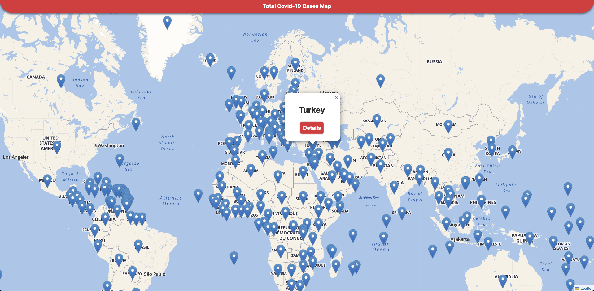
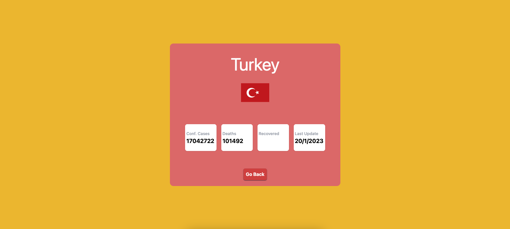
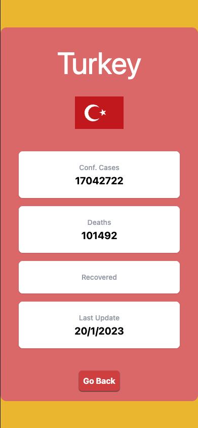
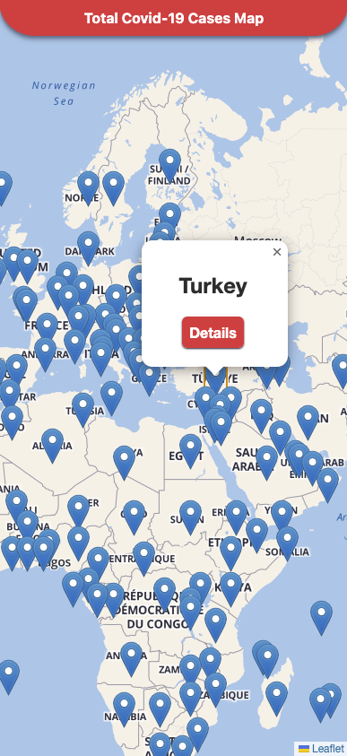

# Covid - 19 Case Map

Its a responsive covid case map app built with React.

## Used Tech Stack and Packages

- React
- TailwindCSS
- ReactQuery
- Axios
- Leaflet
- Jest/React-Testing Library

## Web                                                

  

## Mobile

 

## Setup of Project

Open your Terminal, write and run this code

`git clone https://github.com/umutzengi/covidcase.git `

`cd covidcase`

After this step you have two different ways to start project. Because this a dockerized react app.

 

## First with Docker

### Build the Docker image

`docker build . -t covid-case`

### Run the image

`docker run -p 3000:3000 -d covid-case`

### Open your browser

And go:

`http://localhost:3000/`

 

## Second way without Docker

### Install node packages

`npm install`

### Start project

`npm start`

### Open your browser

And go:

`http://localhost:3000/`

 

## For running unit tests

use `npm run test` command.
